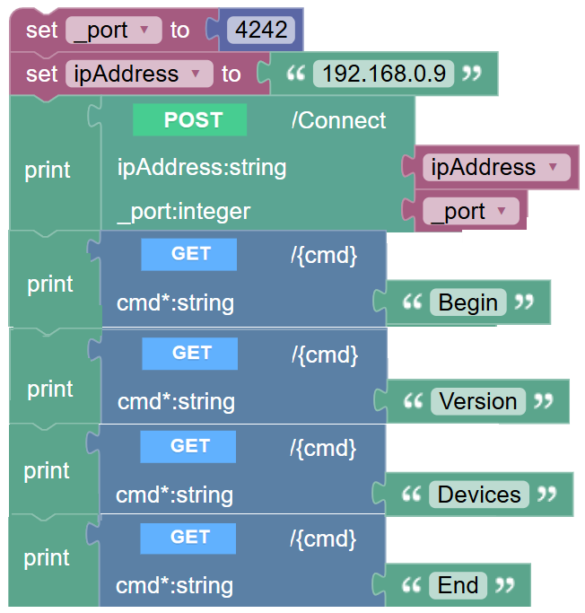

# Soft-ata Version 10.001

---
> Note: All code folders have been moved to  /code folder.
---

## This page:

- [In brief](#in-brief)
- [About](#about)
- [History](#history)
- [API Documentation](#api-documentation)
- [Local Docs](#local-docs)
- [Background](#background)
- [Firmata](#firmata)
- [Soft-ata Projects](#soft-ata-projects)
- [RPi Pico W Arduino](#rpi-pico-w-arduino)
- ["Some" of the required Arduino Libraries](#some-of-the-required-arduino-libraries)
- [Settings](#settings)
- [Use](#use)
- [Blockly](#blockly)
- [Azure IoT Hub](#azure-iot-hub)

## In Brief
**An Arduino sketch _LIKE_ Firmata for a Rapberry Pi  Pico W running Arduino.**
Includes a .NET package so that you can write your own remote client in C# to remotely control Pico devices. 
Console, Blazor and WebAPI app examples included with MAUI possible later. 

**A key objective was to also provide a Blockly style low code device programming using this infrastructure.**
  
_Soft-ata rather than firm-ata!_ 

---

- Documentation:  [Related blog posts](https://davidjones.sportronics.com.au/cats/softata/)

- ***The Arduino Shield code is now downloadable as a Zip file when running the SoftataWebAPI***

## About

The Pico W app runs as a TCPIP Service taking commands, running them and returning the result to the client. 
For peripheral setups, displays and actuators, the expected result is simply an acknowledgement "OK:" string.
For sensor reads, a data string is returned with an "OK:" prefix. The SoftaLib checks and consumes the acknowledgment 
 data before it is forwarded to the client app.

The RPi Pico W has two processing cores. Whilst most interactions occur via the first core, 
some functionality is built into the second core. 
Firstly, the inbuilt LED flashes under control by the second core. 
When the Pico sketch first boots and both cores are ready, it blinks at a slow rate. 
_(4s on/4s off)_. Once a connection is made, it blinks at 4x this rate. 
  - The client app should not try connecting until then.
  - The device can run in a "headless" mode with status being indicated by "Coded flashes on the inbuilt LED" [on this page](https://davidjones.sportronics.com.au/softata/Softata-Arduino_Startup_Options-softata.html).
Communication between the two cores is generally from core one to core two and is done in a synchronized manner.

The second core is also used for autonomous streaming of Sensor Telemetry data over Bluetooth and to an Azure IoT Hub.
Once started, it runs with periodic transmissions without further interaction until a **Pause** or **Stop** command is sent.
When paused, the transmission continues after reception of a **Continue** command. 
For every transmission, there is also a quick double flash by the inbuilt LED.

Whereas Firmata is implemented from the ground up, implemented in terms of protocols with devices being added in terms of those implementations
Softata is implemented in terms of existing specific Arduino device libraries. 
To add a device you include its Arduino library and then slot it into the 
Softata app infrastructure. That code is, in the main, polymorphic. To add for example, a sensor
you copy you copy the template sensor.cpp file and implement the methods in it
according to the devices library samples. You also create header code for it largely by copying an existing sensor's header.
Within the Softata app and SoftataLib code there ar then some specific hooks to add for the device.
This process is documented [here](https://davidjones.sportronics.com.au/softata/Softata-Adding_a_new_device-softata.html). _This needs some updating._

## History

The plan was to implement an Arduino app to run on a [RPi Pico W](https://www.raspberrypi.com/documentation/microcontrollers/raspberry-pi-pico.html) placed in a [Grove Shield for Pi Pico](https://www.seeedstudio.com/Grove-Shield-for-Pi-Pico-v1-0-p-4846.html). 
The Pico W has onboard Arduino implemented using the [earlephilhowe BSP implementation](https://github.com/earlephilhower/arduino-pico). 
The Grove infrastructure being used because of it's simple standardised connectivity between devices and the shield at both ends.
Rather than implement a general purpose interface for devices in One Wire, I2C or SPI, etc, 
use is made of existing Arduino libraries for Grove devices.  

The intention was also to implement a class for each device type (sensor display, actuator etc) such
that the class can be extended for each actual device of that type by implementing the base methods. 
That way, the functionality of the app for a device type needs no modification for any additions. 
Additional non Grove devices can be added by connecting to a Grove cable.  

Ultimately the intention was to stream Telemetry from sensors to an Azure IoT Hub  
Communication with a host app using a client service model with the service running on the Arduino app connected to by clients running on a host. 
This is all now functional. 

A .NET library was built that communicates to the service as a mirror of the Arduino functionality. 
A Console app was built to fully test and demonstrate this functionality. A Blazor app to do same is under development. 
Similarly a .NET MAUI app is envisaged. Finally, a port of the .NET library to the [Wilderness Labs Project Lab V3 ](https://store.wildernesslabs.co/products/project-lab-board)device is also envisaged.***

# API Documentation

The full API documentation is [here](https://davidjones.sportronics.com.au/cats/softata/) __(Extended/updated)__

## Local Docs

- [ReadMe .. this](./README.md)
- [Softata API](./SoftataAPI.md)
- [Repository History](./RepositoryHistory.md)
- [Original ReadMe](./README_V1.md)
- [Second ReadMe version](./README_V2.md)

## Background
I wanted to use a RPI Pico W with Arduino installed controlled by .NET apps. Drilling deeper, 
I wanted to make the Pico coding available with a Blockly style UI as per 
[CodeCraft](https://ide.tinkergen.com/). There is also [BlocklyDuino](https://blocklyduino.github.io/BlocklyDuino/). 

After some consideration Firmata was considered. But this lacks a simple .NET (not UWP) interface.

## Firmata

> Firmata is a protocol for communicating with microcontrollers from software on a host computer. The protocol can be implemented in firmware on any microcontroller architecture as well as software on any host computer software package. [From](https://github.com/firmata/arduino)

So if there a Firmata app running on a device, a host computer can interact directly with the device's hardware through a standard protocol over Serial, Ethernet (Wired or WiFi) or Bluetooth. The Firmata protocol can be viewed in the first link below. There are various implementations of it for various devices:
... There is more discussion of Firmata in the Blog post. ...

> I could get the [ConfigurableFirmata](https://github.com/firmata/ConfigurableFirmata) running on a RPi Pico W over WiFi. The.NET client libraries were quite old and used a Serial connection. Using a .NET TCPIP Client, I found that the functionality I could get working with interactively was limited. So I decided to build my own "Firmata", hence Soft-ata.

## Soft-ata Projects

- See [./code](./code)

## RPi Pico W Arduino

The Pico needs the following BSP installed:
- [earlephilhower RPi Pico W Arduino BSP](https://github.com/earlephilhower/arduino-pico/) 

Its API documentation is [here](https://arduino-pico.readthedocs.io/en/latest/)

This BSP is as per previous repositories here as well as in some blog posts:

- [RPI Pico W GPS Bluetooth and Azure IoT Hub](https://github.com/djaus2/RpiPicoWGPSandBT)
- [Azure IoT Hub Arduino Raspberry Pi Pico with Telemetry](https://github.com/djaus2/Azure_IoT_Hub_Arduino_RPI_Pico_Telemetry)
- [RPI-Pico-Arduino-AzSDK: Context](https://davidjones.sportronics.com.au/ardpico/RPI-Pico-Arduino-AzSDK-Context-pic-ard.html)

------

## "Some" of the required Arduino Libraries

- [DHT11_Temperature_And_Humidity_Sensor](https://github.com/RobTillaart/Arduino/tree/master/libraries/DHTlib)
  - Direct library install from Arduino. Search for **DHTlib**
- [BMx280BMI](https://bitbucket.org/christandlg/bmx280mi/src/master/)
  - Direct library install from Arduino. Search for **BMx280BMI**
- [Grove_Ultrasonic_Ranger](https://github.com/Seeed-Studio/Seeed_Arduino_UltrasonicRanger)
  - Zip file install from [here](https://github.com/Seeed-Studio/Seeed_Arduino_UltrasonicRanger/archive/master.zip)
- [ubg2](https://github.com/olikraus/u8g2) For [Grove OLED096 Display](https://wiki.seeedstudio.com/Grove-OLED_Display_0.96inch/)
  - Direct library install from Arduino. Search for **ubg2**
- [Grove_LCD_RGB_Backlight](https://github.com/Seeed-Studio/Grove_LCD_RGB_Backlight) For Grove-LCD RGB V4.00
  - Zip file install from [here](https://github.com/Seeed-Studio/Grove_LCD_RGB_Backlight/archive/master.zip) 
- [Adafruit NeoPixel](https://github.com/adafruit/Adafruit_NeoPixel)
  - Direct library install from Arduino, Search for **Adafruit NeoPixel**
- [PubSubClient](https://pubsubclient.knolleary.net/)
  - Direct library install from Arduino. Search for **PubSubClient**
- [Azure SDK for C - Arduino](https://github.com/Azure/azure-sdk-for-c-arduino)
  - Direct library install from Arduino. Search for **Azure SDK for C** b Microsoft.
  - Zip install from [azure-sdk-for-c-arduino/releases](https://github.com/Azure/azure-sdk-for-c-arduino/releases)
------

## Settings

The Softata sketch requires at least, a WiFi SSID and Password. If sending telemetry to an Azure IoT Hub then connectivity settings for that are also required. There are a number of ways these settings can be ascribe such as fixed in a header file, input or read from flash. See [Arduino Startup Options](https://davidjones.sportronics.com.au/softata/Softata-Arduino_Startup_Options-softata.html). The flash method can be set and survive download of a new sketch.

## Use

See the [Console app](/code/SoftataConsole). The IpAddress as determined when the Pico W runs must match that in the library. The ports must also match.
The Console test app has multiple options:

- 1  Digital
- 2  Analog
- 3  PWM
- 4  Servo
- 5  Sensors
- 6  Displays
- 7  Serial
- 8  PotLightSoundAnalog
- 9  UltrasonicRange
- 10  PotRelay
- 11  PotServo

The Blazor app has similar functionality.

## Blockly

[SoftataWebAPI](./code/SoftataWebAPI) is an ASP.NET Core API sketch that presents a Blockly and a Swagger interface to all of the SoftataLib (.NET) API commands. This makes use of [ignatandrei/NETCoreBlockly](https://github.com/ignatandrei/NETCoreBlockly). **SoftataWebAPI** can also be used without installation as it is hosted on Azure at [softatawebapii.azurewebsites.net](https://softatawebapii.azurewebsites.net/). Note though that some tunnelling is required to connect SoftataWebAPI and the Softata service running locally on a Pico W.  See [Running Blockly on local Pico from Azure Softata API](https://davidjones.sportronics.com.au/softata/Softata-Running_Blockly_on_local_Pico_from_Azure_SoftataAPII-softata.html). Eg:

This Blockly app connects to the device at 192.168.0.9 (Begin), gets the version number of Softata _(currently 10.001)_, gets a list of devices that can be used, and completes _(which reboots the device)_. 

------

## Azure IoT Hub

- Telemetry can be sent from a sensor connected to the Pico to an Azure IoT Hub. See [Softata-Console_app_-_Sensors](https://davidjones.sportronics.com.au/softata/Softata-Console_app_-_Sensors-softata.html)Some CD messages can be sent to stop, pause and start such telemetry. Control of an actuator via CD Messages is a work in progress.

------

Enjoy! :)

