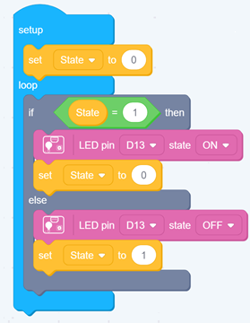
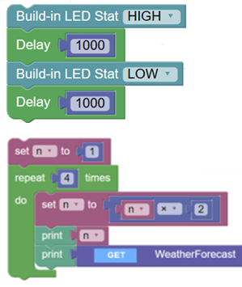

# Soft-ata

## In Brief
**An Arduino app _LIKE_ Firmata for RPI Pico W running Arduino.**
Includes a .NET package so that you can write your own client in C#. 
Console app included with Blazor and MAUI apps coming soon.
  
_Soft-ata rather than firm-ata!_ 

## Background
I wanted to use a RPI Pico W with Arduino installed controlled by .NET apps. Drilling deeper, I wanted to make the Pico coding available to my grandkids with a Blockly style UI as per [CodeCraft](https://ide.tinkergen.com/). There is also [BlocklyDuino](https://blocklyduino.github.io/BlocklyDuino/). But I found that with both, whilst the Arduino Uno is supported there, there is no support for the Pico. I then found [NETCoreBlockly](https://github.com/ignatandrei/netcoreblockly) on GitHub (as discussed by [Scott Hanselman](https://www.hanselman.com/blog/using-the-blockly-visual-programming-editor-to-call-a-net-core-webapi)) for general .NET Blockly programming and looked for a way to extend it for the Pico. So the idea here is to create a .NET package that interfaces to the Pico over WiFi or Bluetooth that then can be integrated into a Blazor app running the .NET Blockly. 

  |   
**Some Blockly coding examples: _CodeCraft, BlocklyDuino and NetCoreBlockly_**

After some consideration I had a back-to-the-future moment. What about Firmata? Alas ...


## Firmata

> Firmata is a protocol for communicating with microcontrollers from software on a host computer. The protocol can be implemented in firmware on any microcontroller architecture as well as software on any host computer software package. [From](https://github.com/firmata/arduino)

So if there a Firmata app running on a device, a host computrer can interact directly with the device's hardware through a standard protocol over Serial, Ethernet (Wired or WiFi) or Bluetooth. THe Firmata protocol can be viewed in the first link below. There are various implementations of it for various devices:

- [Firmata Protocol Documentation](https://github.com/firmata/protocol)
- [Firmata for Arduino](https://github.com/firmata/arduino)
- [ConfigurableFirmata](https://github.com/firmata/ConfigurableFirmata)
- And there is the web app [Firmata Builder](http://firmatabuilder.com/])

There are also [Firmata Client libraries](https://github.com/firmata/arduino#firmata-client-libraries) for use on the host end.

I could get the [ConfigurableFirmata](https://github.com/firmata/ConfigurableFirmata) running on a RPi Pico W over WiFi. The.NET client libraries were quite old and used a Serial connection. Using a .NET Tcpip Client, I found that the functionality I couldget working with interactively was limited. So I decided to build my own "Firmata", hence Soft-ata.

## Soft-ata Projects

- Softata: The Arduino RPI Pico app
- SoftataLib: The. NET Library
- SoftataConsole: A simple .NET Console demo app

## RPi Pico W Arduino

This requires a setup as per previous repositories here as well as in some blog posts:

- [RPI Pico W GPS Bluetooth and Azure IoT Hub](https://github.com/djaus2/RpiPicoWGPSandBT)
- [Azure IoT Hub Arduino Raspberry Pi Pico with Telemetry](https://github.com/djaus2/Azure_IoT_Hub_Arduino_RPI_Pico_Telemetry)
- [RPI-Pico-Arduino-AzSDK: Context](https://davidjones.sportronics.com.au/ardpico/RPI-Pico-Arduino-AzSDK-Context-pic-ard.html)

------

## Repository Status
- Version 1.00
  - All three projects work
  - Digital IO implemented, place holders for other functionality in the Arduino app
  - There are two top level commands:
    - SoftataLib.SendMessageCmd("A simple one word command")
    - SoftataLib.SendMessage(SoftataLib.Commands.XXX,pin, (byte)data)  
```cs
        public enum Commands
        {
            pinMode = 0xD0,
            digitalWrite = 0xD1,
            digitalRead = 0xD2,
            digitalToggle = 0xD3,
            analogWrite = 0xA0, //Not iumplemented

            Undefined = 0xFF
        }
```
  - Digital IO
    - SoftataLib.Digital.SetPinMode(pin, SoftataLib.PinMode.DigitalInput/Output)
    - SoftataLib.Digital.SetPinState(pin, SoftataLib.PinState.HIGH/LOW)
    - SoftataLib.Digital.GetPinState(pin);
    - SoftataLib.Digital.TogglePinState(pin)Thre is also the general commands:
  - Interaction starts with:
    - SoftataLib.SendMessageCmd("Begin")
  - And ends with:
    - SoftataLib.SendMessageCmd("End")
  - A board header file specifies, like in Firmata, valid pins for each interaction type (Digital, Analog, PWM etc)
    -An invalid pin does not crash the Arduino app but cause an exception with the library.
    - A call to a not yet implemented functionality (eg Analog, PWM etc) does not cause any exceptions,
  - There is a Watchdog timer as well as a command to force a sofware reset of the Arduino device.
  - Each message to the device expects a response to be sent to the library and used to check if there was an issue, or contains requetsed data.
    - 2DDo: Implementga timeout mechanism.

------

## Usage

See the [Console app](/SoftataConsole) but the IpAddress as determined when the Pico W runs must match that in the library. The ports must also match.

------

## Roadmap

- Implment the other capailities in the Arduino app:  
```cs
        public enum CommandType : byte
        {
            Digital = 0,
            Analog = 1,
            PWM = 2,
            Servo = 3,
            I2C = 4,
            SPI = 5,
            OneWire = 6,
            Undefined = 0xFF,
        }
```
- Implement same in the library
- Add a Blazor and a maui sample app.
- Integrate the library with a NetCoreBlockly app.

Enjoy! :)


